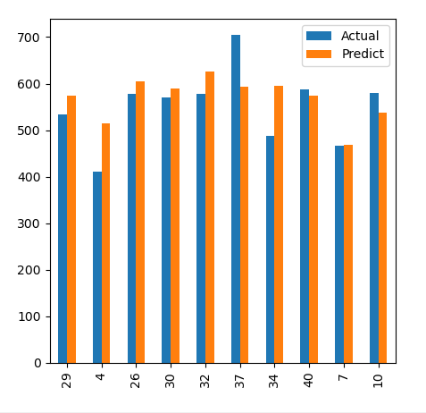

# A Random Forest based Prediction Algorithm 
In this repository, I make a model for predicting customer's patrol consumption based on previous training data.

## Actual VS Predicted Output Plot

I showed a graph comparing the real and the predicted output by the **random forest** model.

This graph is like below:

